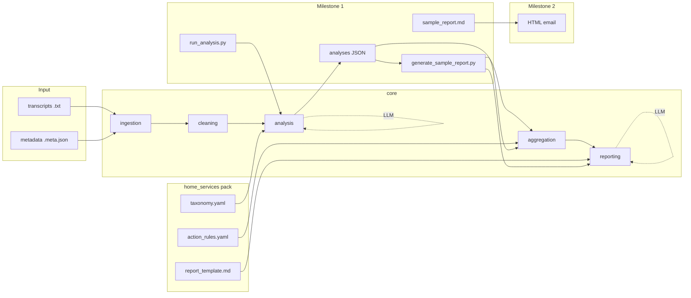

# CallGist

**Weekly call intelligence for home-service owners — delivered to their inbox.**

Every Monday, the owner gets one short email: what customers called about, what went wrong, which leads slipped, and **three things to fix this week**. Readable on a phone in under five minutes.

---

## Example: HVAC owner on Monday morning

**BrightPipe HVAC** · Week of Jun 16–20 · from [`outputs/sample_report.md`](outputs/sample_report.md)

### The email on their phone

**1. Inbox** — subject + preview (what convinces them to open it)

```
┌──────────────────────────────────────────────┐
│  ← Inbox                              CallGist │
├──────────────────────────────────────────────┤
│  CallGist                          7:42 AM  │
│  BrightPipe HVAC — Weekly CallGist (Jun 16–20)│
│  Hi Mike — 45 calls. 3 things for this week: │
│  ↳ Unresolved complaints — escalate today.   │
│  ↳ Pricing clarity — train team on promos.   │
│  ↳ Follow-up gaps — 15 callbacks owed.       │
└──────────────────────────────────────────────┘
```

**2. Opened** — full message (under 5 min read)

```
From: CallGist <reports@callgist.app>
To: Mike Torres <mike@brightpipehvac.com>
Subject: BrightPipe HVAC — Weekly CallGist (Jun 16–20)

Hi Mike,

45 calls this week. Here are the 3 things worth your time:

────────────────────────────────────────
1. ESCALATE — unresolved complaints (3 open)
   Mud tracking (call_03), rude tech (call_20), missed manager callback (call_39).
   Bad review risk if not fixed this week.
────────────────────────────────────────
2. TRAIN ON PRICING — promo vs. real quote
   Drain promo confusion (call_08, call_13) still showing up.
   Customers hear $49 promo but get quoted $189+ on kitchen/stack jobs.
────────────────────────────────────────
3. CLOSE THE LOOP — follow-up protocol
   15 follow-ups flagged (overlapping with leads & complaints).
   Promised estimates, callbacks, and complaint resolutions need owners.
────────────────────────────────────────

AT A GLANCE — 45 calls total
  Outcomes (each call counted once — sums to 45):
    23 booked appointment · 4 follow-up needed · 4 lead lost
    3 complaint unresolved · 3 customer satisfied · 3 no clear outcome
    2 quote requested · 2 spam / irrelevant · 1 complaint resolved
  Action flags (can overlap — not a partition):
    15 follow-ups owed · 2 likely lost leads · 4 complaints · 11 new leads
  Top repeat issue: pricing unclear

ALSO CALL BACK: call_01 (lost AC lead at dispatch fee), call_06 (missed quote callback)

— CallGist · Reply if something looks wrong
```

The inbox preview and the opened email tell the same story — preview hooks them; the email gives them enough to act.

Full report: [`outputs/sample_report.md`](outputs/sample_report.md)

---

## The problem

Home-service owners run on phone calls but cannot listen to every one:

- Emergency leads lost over unclear dispatch fees
- The same complaint showing up all week before anyone connects the dots
- Promised callbacks that never happen

CallGist turns a week of calls into **action** — not transcripts, not noise.

---

## Why owners trust it

Wrong “lost lead” claims kill the product. CallGist backs every headline with evidence:

- Per-call analysis with customer quotes
- Lost leads and follow-ups counted by rules, not guessed by the LLM
- Uncertain calls flagged separately

Sample validation: [`docs/validation_results.md`](docs/validation_results.md) — 100% intent / 80% outcome on 10 test calls.

---

## Try it

```bash
pip install -r requirements.txt
cp .env.example .env          # OPENAI_API_KEY

python scripts/run_analysis.py --workers 4
python scripts/generate_sample_report.py
```

For large batches, use `--skip-existing` to resume after interruptions (skips calls that already have JSON in `outputs/analyses/`). Tune `--workers` to your OpenAI rate limit tier (default: 4 from `configs/generic.yaml`).

| Output | Path |
|--------|------|
| Weekly report | [`outputs/sample_report.md`](outputs/sample_report.md) |
| Per-call detail | [`outputs/analyses/`](outputs/analyses/) |
| Sample calls | [`data/sample_transcripts/`](data/sample_transcripts/) |

Showing the report to a pilot owner: [`docs/owner_pilot_guide.md`](docs/owner_pilot_guide.md)

---

## Roadmap

| Stage | Owner experience |
|-------|------------------|
| **Now** | Weekly report generated; email it to the owner |
| **Next** | Mobile-friendly HTML email, sent automatically each week |
| **Then** | Paid pilots — track opens and whether owners act on the 3 items |

[`plan.md`](plan.md) · [`docs/data_handling.md`](docs/data_handling.md) · [`docs/DISCLAIMER.md`](docs/DISCLAIMER.md)

---

## License & disclaimer

Licensed under the [MIT License](LICENSE).

Sample transcripts and demo reports are **fictional**. If you use CallGist on real calls, you are responsible for recording consent, privacy, and third-party API terms (e.g. OpenAI). AI-generated reports may be wrong — verify before acting. Full details: [`docs/DISCLAIMER.md`](docs/DISCLAIMER.md). Security: [`SECURITY.md`](SECURITY.md).

---

<details>
<summary>For developers</summary>

### Architecture

```text
                    ┌─────────────────────────────────────────┐
                    │         Generic Engine (core/)          │
                    │  ingest → clean → analyze → aggregate   │
                    │              → report                   │
                    └──────────────────┬──────────────────────┘
                                       │
                    ┌──────────────────▼──────────────────────┐
                    │   Home Services Pack (industry_packs/)  │
                    │  taxonomy · action_rules · email/report │
                    │              templates                  │
                    └─────────────────────────────────────────┘
```

### Pipeline flow (Milestone 1)

```text
  INPUT                         PROCESS                         OUTPUT
  ─────                         ───────                         ──────

  data/sample_transcripts/
    *.txt  ──────────┐
    *.meta.json      │
                     ▼
              scripts/run_analysis.py
                     │
         ┌───────────┼───────────┐
         ▼           ▼           ▼
    core/ingest  core/clean  core/analysis ──► OpenAI API (parallel)
         │           │           │              (per-call JSON)
         └───────────┴───────────┘
                     │
                     ▼
           outputs/analyses/<call_id>.json

  outputs/analyses/*.json
                     │
                     ▼
        scripts/generate_sample_report.py
                     │
         ┌───────────┴───────────┐
         ▼                       ▼
  core/aggregation          core/reporting ──► OpenAI API
  + action_rules.yaml       + Jinja template     (summary + 3 actions)
         │                       │
         └───────────┬───────────┘
                     ▼
           outputs/sample_report.md
                     │
                     ▼ (Milestone 2)
              owner email / phone
```



| Path | Role |
|------|------|
| `core/` | Engine modules |
| `configs/` | Model, thresholds, caps |
| `industry_packs/home_services/` | Taxonomy, rules, templates |
| `prompts/` | LLM system prompts |
| `data/ground_truth.yaml` | Validation labels |

**Scripts:** `run_analysis.py` (`--workers`, `--skip-existing`, `--force`) · `generate_sample_report.py` · `ground_truth_review.py` · `delete_call.py`

</details>
